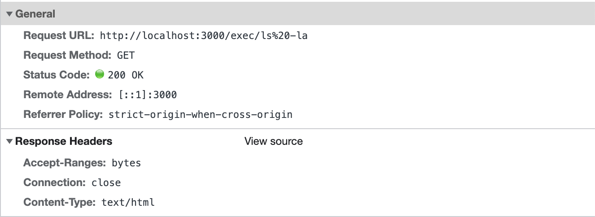
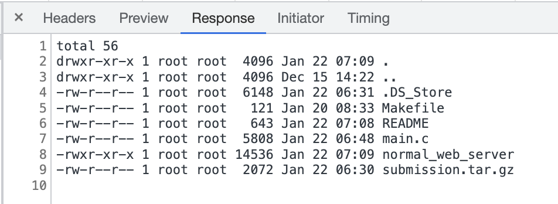

# Project 2: Backdoor Web Server Assignment

### Purpose

This is a minimal HTTP 1.1 web server implemented in C, based on RFC 2616 from scratch, without using any libraries except for the C standard library.
It uses the standard socket library to create a socket and bind it to a specified port number that is assigned as a command-line argument.
When a request is recieved, the server parses the request to check if it is a valid GET request and if so, it extracts the requested url.
The server then sends a 200 OK response along with the contents of the executed linux command, though if not valid the server sends a 404 NOT FOUND response. The server also has a handler for the SIGINT (ctrl + c) which closes the open sockets and exits the program.

### Getting Started

1. Build the image with ubuntu 18.04

```sh
docker build . -t ubuntu:web-server
```

2. Run container and expose port 3000 on OS port 3000

```sh
docker run --rm -it -p 3000:3000 ubuntu:web-server
```

3. Test container

```sh
curl localhost:3000
```

### Example Usage

#### execute `ls`

```sh
# execute
curl localhost:3000/exec/ls
```

```sh
# response
Makefile
README
main.c
normal_web_server
submission.tar.gz
```

#### execute `ls -la`

```sh
# execute
curl localhost:3000/exec/ls%20-la
```

```sh
# response
total 56
drwxr-xr-x 1 root root  4096 Jan 22 06:23 .
drwxr-xr-x 1 root root  4096 Dec 15 14:22 ..
-rw-r--r-- 1 root root  6148 Jan 22 02:53 .DS_Store
-rw-r--r-- 1 root root   121 Jan 20 08:33 Makefile
-rw-r--r-- 1 root root    49 Jan 20 07:44 README
-rw-r--r-- 1 root root  5683 Jan 22 06:22 main.c
-rwxr-xr-x 1 root root 14576 Jan 22 06:23 normal_web_server
-rw-r--r-- 1 root root  1770 Jan 22 02:53 submission.tar.gz
```

#### or from the browser



